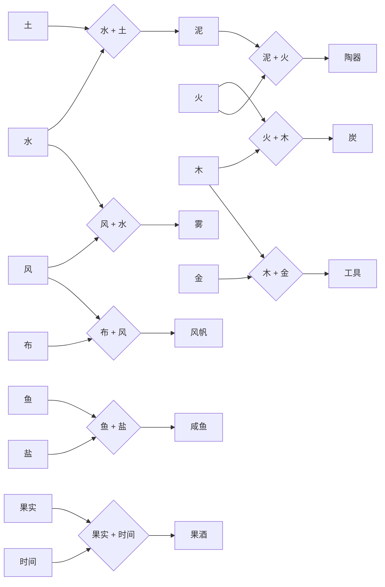
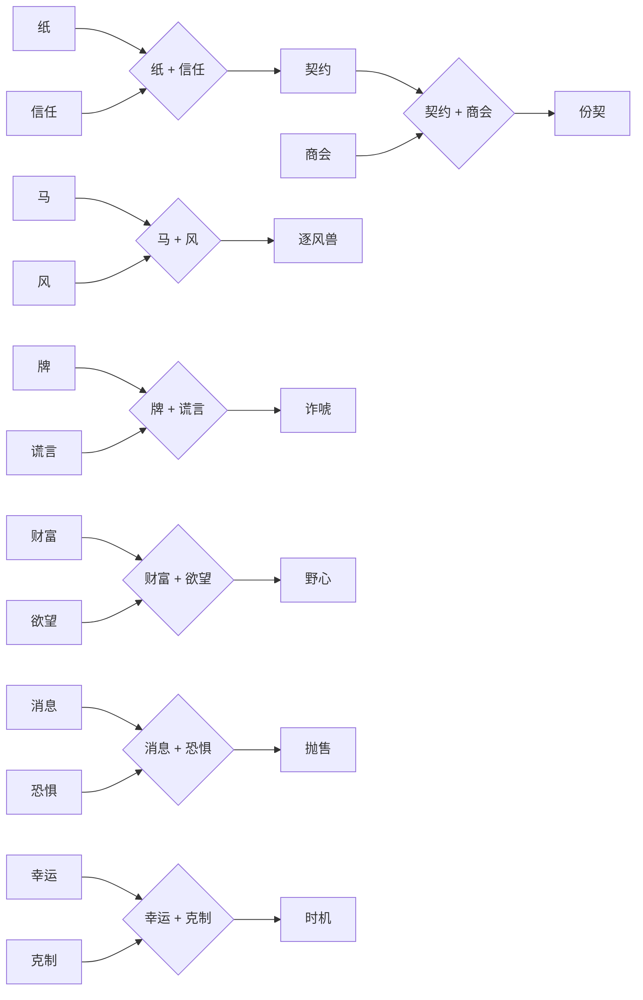

# 《万物之岛》万物合成系统设计 v0.1

> 状态：首轮原型规格  
> 上位依据：总文档第 4、5、6、13、15、17 节  
> 关联文档：`00_优先模块设计索引_v0.1.md`、`03_金贝与基础经济设计_v0.1.md`、`04_时间日程与结算设计_v0.1.md`、`08_商店与交易系统设计_v0.1.md`、`09_背包与物品系统设计_v0.1.md`

## 1. 模块定位

万物合成是游戏的探索主轴，不是靠随机抽取稀有物的制造系统。玩家通过观察事物的**材质、用途、意念**三层联系，提出组合猜想，并用造化盆验证。

它承担四个职责：

1. 提供持续的发现感；
2. 把岛屿中的材料、人物和事件连接起来；
3. 为牌会、竞速与后续商会系统提供可使用的机会；
4. 通过图谱和献塔推动长期成长。

## 2. 体验目标与非目标

### 2.1 体验目标

- 玩家看到新元素时，会自然想到“它能和什么组合”。
- 正确配方来自可理解的联系，而不是无提示穷举。
- 失败会缩小答案范围或产生有趣残物，不等于纯浪费。
- 首次发现是一件值得停下来观看和记录的事件。
- 同一造物在“出售、使用、交付、献塔”之间形成真实取舍。

### 2.2 非目标

- 不做需要记忆数百条隐藏公式的炼金模拟器。
- 不让基础配方依赖随机成功率。
- 不用付费、等待倒计时或体力限制合成次数。
- 不让合成道具直接泄露牌面或保证赛果。
- 不在首版加入装备强化、耐久、词条洗炼等平行养成。

## 3. 系统边界

### 3.1 输入

- 玩家可以放入 N 种材料，每种材料投入 1 个实体。
- N 的上限等于玩家当前拥有的材料种类数；首版是否设置操作层面的槽位上限，暂不定案。
- 单条配方内部的材料顺序无关。
- 每次普通尝试不消耗时间。

### 3.2 输出

| 输出类型 | 结果 | 是否进入背包 | 是否记录图谱 |
|---|---|---:|---:|
| 新发现 | 首次得到有效造物 | 是 | 是，完整记录 |
| 已知制作 | 重复生产已知造物 | 是 | 更新制作次数 |
| 部分命中 | 投入材料中的一个子集组成有效配方，其余材料损失 | 是 | 按新发现或已知制作处理 |
| 无直接关系 | 生成残材或怪东西 | 是 | 记录排除信息 |

## 4. 造物数据结构

每个元素或造物至少包含以下字段：

```yaml
item_id: water
name: 水
kind: element | material | product | concept | phenomenon
tags:
  material: [液体, 潮]
  use: [饮用, 清洗, 灌溉]
  intent: [滋养, 流动]
rarity: common | uncommon | rare | unique
base_value: 8
tradable: true
consumable: true
stack_limit: 99
sources: [漂流湾, 商店]
```

配方数据单独记录：

```yaml
recipe_id: mud
inputs: [water, earth]
output: mud
output_count: 1
logic_axis: material
hint_chain: [潮湿, 黏合, 成形]
world_event: null
```

## 5. 核心规则

### 5.1 材料与实体

- 背包记录“材料种类”和“实体数量”两个层级。例如玩家拥有“水 ×3”，表示已经解锁水这种材料，背包中还有 3 个可投入的水实体。
- 每次选择一种材料投入造化盆，就从该材料中投入 1 个实体。
- 提交合成后，所有已经投入的实体都会被消耗，包括没有参与最终配方的多余材料。
- 某种材料的实体数量降为 0 后，玩家暂时不能再投入它；已经获得的图谱知识不会消失。

### 5.2 配方判定

玩家认为手中的若干材料可能存在联系时，可以把它们一起投入造化盆。系统按以下逻辑判定：

1. 玩家选择 N 种材料，每种投入 1 个实体；
2. 如果全部 N 种材料正好构成一条配方，则生成对应造物；
3. 如果只有其中 N-M 种材料构成一条配方，则仍然生成该造物；
4. 没有参与配方的 M 个材料实体同样消失，不返还、不转化；
5. 如果不存在任何可成立的材料组合，则本次合成失败，全部投入实体消失；
6. 每次成功默认生成 1 个结果实体。

示例：

```text
投入：水 + 土
命中：水 + 土 → 泥
结果：获得泥 ×1；水 ×1、土 ×1 被消耗
```

```text
投入：水 + 土 + 盐
命中：水 + 土 → 泥
结果：获得泥 ×1；水 ×1、土 ×1、盐 ×1 全部被消耗
```

系统不检查天气、时段、地点、人物或额外“契机”。正确材料已经放入后，就直接生成对应造物。

### 5.3 多配方冲突

当同一批投入材料能够命中两条或更多配方时，按照**材料投入顺序**决定结果。一次合成最多生成一个结果。

判定顺序如下：

1. 如果全部投入材料正好构成一条完整配方，优先生成这条完整配方的结果；
2. 如果不存在完整配方，系统按投入顺序依次读取材料；
3. 第一条材料已经全部进入队列的有效配方立即锁定；
4. 锁定后不再检查后续可能成立的其他配方；
5. 全部投入实体仍然一起消耗。

示例一：

```text
投入顺序：水 → 土 → 风

水 + 土在第二步首先成立，因此生成“泥”。
风没有参与配方，但同样消失。
```

示例二：

```text
投入顺序：风 → 水 → 土

风 + 水在第二步首先成立，因此生成“雾”。
土没有参与配方，但同样消失。
```

如果两条配方在同一步同时成立，优先选择包含更早投入材料的配方；仍然相同时，优先选择使用材料数量更多的配方。配方表不得出现输入集合完全相同但结果不同的重复配方。

### 5.4 首次发现与重复制作

首次发现流程：

1. 造化盆展示材料关系；
2. 显示新造物动画与名称；
3. 解锁图谱卡；
4. 说明其已知用途，但不直接剧透所有后续配方；
5. 将本次生成的 1 个造物实体放入背包，作为玩家拥有的第一份样本。

重复制作：

- 已知配方可从图谱一键填入，但仍需要真实材料。
- 每次重复制作默认生成 1 个结果实体。
- 图谱自动填入只会投入配方所需材料，不会主动加入多余材料。
- 已知配方支持批量制作，玩家可以选择 1、5 或“最大”数量。
- 批量制作按配方逐份扣除材料、逐份生成结果；最大数量由当前材料库存决定。
- 批量制作不增加成功率或产量，不消耗潮刻，只减少重复操作。

### 5.5 失败与理解积累

错误组合不直接显示“没有配方”，而按接近程度反馈：

| 反馈 | 含义 | 资源结果 |
|---|---|---|
| 毫无呼应 | 投入材料中不存在有效组合 | 全部实体消失，记录已经验证的组合 |
| 隐约呼应 | 材料方向相关，但还缺少正确材料 | 全部实体消失，记录一条材料方向线索 |
| 部分命中 | 一部分投入材料构成有效配方 | 生成对应造物，全部投入实体消失 |

### 5.6 理解等级

每条未完成配方有 0—3 级理解：

- 0：未知；
- 1：知道一类相关标签；
- 2：知道其中一个准确材料；
- 3：显示缺失材料的候选范围。

理解来自人物谈话、观察世界、失败尝试、事件复盘和相关配方发现。理解不是成功率加成，而是信息质量提升。

原型界面必须把这套反馈直接表现出来：失败结算列出实际消耗材料，并明确区分“彼此无应”“有变未成”“反应失衡”和“结构被冲散”，再提供一条不直接泄露配方答案的下次建议。不能只显示“合成失败”。

成功结算分为首次发现与重复制作。首次发现使用独立揭示页面，展示造物插图、名称、来历、类别、保守价值和图鉴进度；重复制作保留简化反馈。万物图鉴采用九格收藏陈列，未发现项目只显示暗影和发现条件，不提前公开名称与配方。

## 6. 造物用途与取舍

每件有效造物可以拥有以下用途中的一种或多种：

| 用途 | 规则 |
|---|---|
| 出售 | 按基础价值与当日需求换取金贝 |
| 使用 | 消耗后改变一次牌会、赛事或探索的信息条件 |
| 交付 | 完成人物请求或触发一个世界事件 |
| 继续合成 | 作为高级配方材料 |
| 收藏 | 保留首次发现样本并完善图谱展示 |
| 献塔 | 永久消耗一件合格造物，推进塔纹 |

“首次样本”只是一件普通实体，不额外锁定。玩家卖掉或献塔后仍保留配方知识，但若想收藏实体，需要重新制作。

## 7. 与其他模块的接口

### 7.1 命运牌会

首版只设计外围辅助，不改变牌面概率：

| 造物 | 效果 | 限制 |
|---|---|---|
| 静心香 | 本场第一次面对大额下注时，补充显示玩家已观察到的对手行为 | 每场一次，不评价牌力 |
| 回声簿 | 自动保存上一轮同一对手的下注尺寸 | 只整理公开信息 |
| 待客饮品 | 提高一名 NPC 在牌后闲聊的意愿 | 可能得到传闻，不保证有利信息 |

### 7.2 逐风竞速

| 造物 | 效果 | 限制 |
|---|---|---|
| 观风铃 | 更准确显示下一场风向区间 | 不改变天气 |
| 护蹄膏 | 马主玩法中改善一次场地适性 | 首版只作为委托物品 |
| 静潮饲料 | 让赛前状态描述更稳定 | 不保证获胜，不能用于非公开投药 |

### 7.3 金贝经济

- 普通可重复造物的直接出售毛利目标为材料成本的 20%—60%。
- 有明确消息或限时需求时可达到 100%—200%，但需求有数量上限。
- 玩家可以从商店购买已经发现过的材料；价格按照合成难度和供需关系设定。
- 商店回收价默认不高于基础价值的 60%；委托和事件需求使用独立报价。

### 7.4 时间与日程

- 合成本身不消耗潮刻，也不依赖天气、地点或时段。
- 会影响赛事、牌会、商会或人物状态的造物，在被使用或交付时才创建对应事件。
- 世界影响按相关模块的下一个结算点生效，避免一次合成操作中重复结算。
- 日终统一处理造物引起的需求、人物记忆和后续新闻。

## 8. 图谱界面

图谱按“已发现、存在明确线索、仅有传闻、完全未知”四种状态展示。

单条图谱包含：

- 名称与插画；
- 材质、用途、意念标签；
- 首次发现的时间、地点和故事；
- 已验证配方；
- 未完成的关系线索；
- 当前拥有数量；
- 已知的出售、使用、交付和献塔用途。

图谱不直接显示未发现配方的完整公式。玩家可以把最多 3 条线索钉在屏幕侧边，方便探索时验证。

## 9. 首版内容范围

### 9.1 元素结构

- 8 个自然元素：水、土、火、木、风、石、鱼、果实；
- 6 个工艺/生活元素：盐、布、纸、金、房屋、时间；
- 6 个抽象元素：信任、消息、幸运、恐惧、克制、欲望；
- 30 条固定配方；
- 5 种失败残物。

### 9.2 初始图谱草案

以下只整理总文档已经出现的配方示例，不代表首版最终的 30 条配方。所有箭头只表示材料组合，不表示天气、地点、人物、时段或其他条件。

每个菱形节点是一条配方。所有指向该菱形的材料都需要投入，菱形再指向生成结果。

#### 自然、工艺与生活配方



#### 财富与抽象配方



| 编号 | 投入材料 | 结果 | 层级 | 状态 |
|---|---|---|---|---|
| R001 | 水 + 土 | 泥 | 自然 | 总文档已有示例 |
| R002 | 火 + 木 | 炭 | 自然 | 总文档已有示例 |
| R003 | 风 + 水 | 雾 | 自然 | 总文档已有示例 |
| R004 | 泥 + 火 | 陶器 | 工艺 | 总文档已有示例 |
| R005 | 木 + 金 | 工具 | 工艺 | 总文档已有示例 |
| R006 | 布 + 风 | 风帆 | 工艺 | 总文档已有示例 |
| R007 | 鱼 + 盐 | 咸鱼 | 生活 | 总文档已有示例 |
| R008 | 果实 + 时间 | 果酒 | 生活 | 总文档已有示例 |
| R009 | 纸 + 信任 | 契约 | 财富 | 总文档已有示例 |
| R010 | 契约 + 商会 | 份契 | 财富 | 总文档已有示例 |
| R011 | 马 + 风 | 逐风兽 | 财富 | 总文档已有示例 |
| R012 | 牌 + 谎言 | 诈唬 | 财富 | 总文档已有示例 |
| R013 | 财富 + 欲望 | 野心 | 抽象 | 总文档已有示例 |
| R014 | 消息 + 恐惧 | 抛售 | 抽象 | 总文档已有示例 |
| R015 | 幸运 + 克制 | 时机 | 抽象 | 总文档已有示例 |

图谱扩展时遵守以下约束：

1. 每条配方只由投入材料决定；
2. 每次成功默认生成 1 个结果实体；
3. 上一层生成物可以继续成为下一层材料；
4. 每个初始元素至少拥有 2 条可发现去向；
5. 首版形成 3—5 条连续三层以上的合成链；
6. 新增配方时必须检查投入顺序造成的结果是否清楚；
7. 抽象概念如果保留为材料，必须明确它如何成为背包中的实体。

### 9.3 首版必须覆盖的用途

- 至少 8 件可直接出售的造物；
- 至少 3 件牌会辅助造物；
- 至少 3 件竞速相关造物；
- 至少 5 件可以献塔；
- 至少 5 条配方需要从 NPC、探索或失败中获得材料线索。

## 10. 数值基线

| 项目 | 首轮参数 |
|---|---:|
| 普通材料价格 | 5—40 金贝 |
| 稀有材料价格 | 50—200 金贝 |
| 普通造物基础价值 | 20—120 金贝 |
| 高阶造物基础价值 | 100—500 金贝 |
| 完全失败损失 | 全部投入实体 |
| 部分命中损失 | 全部投入实体，同时获得 1 个命中结果 |
| 普通合成时间 | 0 潮刻 |
| 单次默认产量 | 1 个结果实体 |
| 批量制作数量 | 1、5 或当前材料可制作的最大数量 |
| 首轮原型献塔要求 | 5 件不同造物 |

以上均是原型调参起点，不是永久经济定案。

## 11. 边界与防滥用

- 相同材料组合始终得到相同配方结果，不使用随机成功率。
- 所有投入实体在提交后立即消耗，不能在看到结果后撤回多余材料。
- 图谱一键制作只投入准确配方，手动试验才允许投入多余材料。
- 系统必须记录每次投入、命中子集、消耗实体和生成结果，便于检查物品守恒。
- 辅助造物不能显示底牌、精确胜率或赛果。
- 事件造物造成的市场/赛事影响设数量上限，同类效果不无限叠加。
- 剧情唯一造物在献塔或交付前提供明确不可逆提示。
- 自动填入配方不会拿走已收藏、已锁定或任务保留的最后一件材料。

## 12. 原型验收

1. 玩家能自由投入任意数量的已有材料种类，每种投入 1 个实体。
2. 精确命中配方时，正确生成 1 个结果实体，并消耗全部输入实体。
3. 部分命中时，正确生成命中结果，多余材料同样消失。
4. 完全失败时不生成有效造物，全部投入实体消失，并记录本次验证。
5. 已知配方的一键填入不会加入多余材料，也不会消耗受保护的最后一个实体。
6. 合成不推进时段，不受天气、地点、人物或其他外部条件阻挡。
7. 对所有首版配方运行组合测试，多配方投入始终按照相同顺序得到相同结果。

## 13. 待定问题

- 首版界面是否需要设置最大投入种类数，避免材料很多时操作过于拥挤。
- 完全失败是否固定生成怪东西；若生成，它是否只是表现性收藏，还是拥有基础回收价值。
- “时间、信任、欲望”等抽象元素如何成为背包中的可投入实体。
