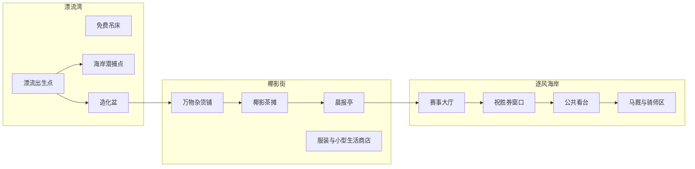

# 《万物之岛》地图与移动系统设计 v0.1

> 状态：首轮原型规格  
> 上位依据：总文档第 3、4、10、11、15、17 节  
> 关联文档：`04_时间日程与结算设计_v0.1.md`、`06_NPC与基础社交系统设计_v0.1.md`、`08_商店与交易系统设计_v0.1.md`

## 1. 模块定位

地图负责把核心玩法放进一座可以理解、记住和向往的海岛。玩家应通过步行看到贫穷与富裕、公共生活与特殊机会之间的空间关系，而不是在功能菜单之间跳转。

首版地图只制作足以跑通完整闭环的三个相连区域：漂流湾、椰影街、逐风海岸。风铃港、金潮坡、云顶区保留为远景、路牌或关闭入口，不在首版制作完整内容。

## 2. 体验目标与非目标

### 2.1 体验目标

- 玩家在第一次游玩15分钟内记住三个区域的相对位置。
- 从出生点到造化盆、商店、牌桌和赛场都有清楚动线。
- 即使贫穷，玩家仍可进入主要公共区域并观看富裕生活。
- 地图能显示人物、活动和服务，但不替玩家自动完成探索。
- 移动提供海岛生活感，不消耗大量时间或变成体力劳动。

### 2.2 非目标

- 首版不制作无缝覆盖整座岛的大世界。
- 不用财富头衔隐藏整个区域。
- 不设计需要反复跑长路的日常委托。
- 不加入饥饿、体力、载重或交通维护。
- 不让跨区域移动消耗潮刻。

## 3. 首版空间结构



### 3.1 区域连接

```text
漂流湾 ←→ 椰影街 ←→ 逐风海岸
```

- 漂流湾和椰影街之间通过海边石阶与短坡连接；
- 椰影街和逐风海岸之间通过临海大道连接；
- 三个区域在远景上互相可见，玩家始终能用万象塔、海岸和商业街判断方向；
- 首版不提供漂流湾直达逐风海岸的捷径，避免第一次游玩跳过商店与茶摊。

## 4. 区域设计

### 4.1 漂流湾

| 兴趣点 | 功能 | 开放规则 |
|---|---|---|
| 漂流出生点 | 开场、返回提示、首次万物 | 始终开放 |
| 免费吊床 | 睡眠、日终、存档入口 | 始终开放 |
| 海岸潜捕点 | 下水抓鱼、海况观察与无本金恢复 | 每日3个有效鱼群窗口 |
| 造化盆 | 左右双槽合成、历史、图鉴 | 始终开放 |
| 海边路牌 | 指向椰影街、逐风海岸与远景区域 | 始终开放 |

漂流湾要让贫穷状态仍然舒适：开阔海景、音乐、公共座椅和远处富裕区域都不收费。

### 4.2 椰影街

| 兴趣点 | 功能 | 开放规则 |
|---|---|---|
| 万物杂货铺 | 组合提示、试验优惠 | 始终开放，夜间由代班店员服务 |
| 蓝鳍鱼铺 | 鱼价、收购、订单与库存说明 | 始终开放，报价按时段刷新 |
| 椰影茶摊 | 教学牌会、低额桌、人物闲谈 | 始终开放 |
| 晨报亭 | 查看天气、赛事、人物、游客、船期、产业订单和供需消息 | 始终开放 |
| 服装与生活商店 | 首次可见消费 | 始终进入，商品按头衔开放 |
| 公共广场 | 环境居民、事件与NPC碰面 | 始终开放 |

椰影街和漂流湾必须持续呈现开放港口的经济规模：根据同一世界状态显示抵港船只/飞艇、装卸货箱、鱼铺排队、餐厅客流与临时摊位。表现使用少量复用角色和环境动画，不要求把60—120名常住居民逐个实体化。

### 4.3 逐风海岸

| 兴趣点 | 功能 | 开放规则 |
|---|---|---|
| 赛事大厅 | 进入独立全屏逐风赛场，查看中央八兽、阵容、历史与赛程 | 始终开放 |
| 祝胜券窗口 | 购票与封盘信息 | 始终开放，票种按账户财富值开放 |
| 公共看台 | 观看比赛 | 始终免费开放 |
| 马厩与骑师区 | 与阿葵等骑师交谈、交付委托 | 始终可进入公共部分 |
| 贵宾露台入口 | 展示未来高阶生活 | 首版只展示锁定状态，不制作内部空间 |

赛事大厅、祝胜券窗口和公共看台进入同一份逐风赛场状态，不分别创建三套比赛数据。封盘前退出页面返回对应世界入口；正式比赛开始后保持活动快照，冲线结算完成才允许返回世界。

## 5. 移动规则

### 5.1 步行

- 同一区域内两个主要兴趣点之间目标步行时间为5—15秒；
- 相邻区域中心之间目标步行时间为20—40秒；
- 步行、奔跑和站立都处于`world_active`，现实经过时间按当前日长档自然进入潮刻进度；
- 移动本身不再额外扣除一笔固定潮刻；
- 玩家可以奔跑，奔跑不消耗体力；
- 任务目标不应要求连续往返同一路线超过两次。

### 5.2 快速前往

- 玩家第一次亲自到达一个区域后解锁该区域的公共站点；
- 打开地图可快速前往已经解锁的公共站点；
- 地图界面使用`ui_paused`，浏览路线和选择目的地时自然世界时间停止；
- 快速前往不消耗金贝，到达目标入口后固定推进0.25潮刻；
- 如果0.25潮刻会跨过时段、报价刷新或日终边界，确认页提前提示；
- 剧情追逐、比赛演出或结算过程中暂时不可快速前往；
- 快速前往只到区域入口，不直接传送进牌桌、商店结算页或比赛中。

### 5.3 建筑进入

- 小型摊位和商店优先采用开放式门面，不单独加载；
- 茶摊、造化盆和祝胜券窗口都在公共空间；
- 未来大型俱乐部、住宅和万象塔内部允许独立加载；
- 玩家离开交易或对话界面后回到进入前的准确位置。

## 6. 地图界面

地图默认显示：

- 一张连续的手绘海岛全景，而不是按功能切开的纯色矩形区域；
- 漂流湾、椰影街、逐风海岸在同一条道路与海岸线上自然过渡；
- 万象塔使用具有层级、窗光、风铃与平台细节的正式地标插图，并随图鉴进度逐层点亮；

- 当前所在位置与朝向；
- 已发现的区域和兴趣点；
- 核心服务图标：合成、潜捕、鱼铺、研究商店、牌桌、赛事、睡眠；
- 已认识核心NPC的当前区域或活动状态；
- 玩家主动追踪的委托和特殊活动；
- 当前时段、天气和下一项标记活动。

地图打开期间进入`ui_paused`。关闭地图返回世界后从原连续进度恢复，不补算阅读地图期间的现实时间。

地图不显示：

- 尚未发现的隐藏万物精确位置；
- 未认识人物的实时位置；
- 未获得来源的秘密事件；
- 逐风兽真实胜率或牌手隐藏状态。

## 7. 地图标记规则

| 标记状态 | 表现 |
|---|---|
| 未发现 | 不显示或只显示模糊区域轮廓 |
| 已发现 | 显示名称、图标和快速前往点 |
| 当前可用 | 正常显示 |
| 暂时不可用 | 保留图标并说明恢复条件 |
| 头衔不足 | 显示入口与所需账户财富值，不隐藏地点 |
| NPC移动中 | 显示目标区域，不显示精确坐标 |

财富不足不会把高级生活从地图上抹去。玩家可以看见贵宾入口、远处庄园和高级区域，只是暂时不能使用其中的特殊服务。

## 8. 时段与环境变化

| 时段 | 漂流湾 | 椰影街 | 逐风海岸 |
|---|---|---|---|
| 清晨 | 鱼群、漂流物、柔和光线 | 店铺开门、晨报更新 | 新秀短途与训练 |
| 白天 | 游客与公共活动 | 最繁忙的交易和居民活动 | 常规比赛 |
| 傍晚 | 金色海面、休闲人群 | 拍卖和露天活动预留 | 巡游和大型比赛 |
| 夜晚 | 安静海滩、契灵线索 | 茶摊牌局和夜间代班 | 星光赛和灯火看台 |

时段只改变人物、气氛和常见机会，不关闭造化盆、低额牌桌、普通商店、公共看台或无本金活动。

## 9. 首次游玩动线

```text
漂流出生点
→ 榕奶奶与造化盆：获得两种万物并完成首次合成
→ 椰影街万物杂货铺：认识关系提示与试验优惠
→ 椰影茶摊：完成教学牌会
→ 晨报亭：查看当日赛事
→ 逐风海岸：领取体验祝胜券并观看首次比赛
→ 返回漂流湾吊床或自由活动
```

这条路线负责介绍系统，但不使用不可见墙强迫玩家。玩家可以先下水抓鱼、闲逛或直接前往赛场；未完成的基础教学保留在对应地点。

## 10. 与其他模块的接口

### 10.1 NPC与社交

- 已认识NPC的区域位置来自统一日程系统；
- 必要服务NPC离开时显示代班服务；
- 地图追踪人物只到区域，不精确到脚下，保留轻量寻找感。

### 10.2 商店与图鉴

- 商店知识服务界面由兴趣点调用；
- 线索写入研究记录，优惠等有限服务写入账户凭证；
- 地图不复制商品清单，只显示商店类型、开放状态和当前可用服务。

### 10.3 时间与财富头衔

- 步行与站立承受自然走时但不追加固定成本，快速前往固定消耗0.25潮刻；
- 时段边界统一切换环境与NPC位置；
- 财富头衔只控制服务和商品，不控制公共区域可见性；
- 头衔下降后，高级入口立即显示关闭，但玩家不会被从公共区域强制传走。

### 10.4 海岸潜捕与鱼市

- 漂流湾大地图只放置一个海岸潜捕入口，白沙浅湾、珊瑚礁棚和沉船外缘在潜捕界面内选择；
- 潜捕标记显示当日剩余有效鱼群窗口，不在地图上显示水下鱼种精确坐标；
- 蓝鳍鱼铺位于椰影街，地图只显示营业状态、当前高价鱼摘要和下次报价刷新时间；
- 港口人流、货箱与船只读取游客量、到港批次、餐饮/出口订单和商会经营的同源状态，不能只是与经济无关的随机装饰；
- 特殊鱼群、沉船线索和外岛潜捕点只有在玩家获得可靠来源后才写入地图；
- 潜捕上岸后回到原海岸入口，出售鱼获需要前往蓝鳍鱼铺或使用后续明确解锁的收购服务。

## 11. 首版内容范围

- 漂流湾、椰影街、逐风海岸三个区域；
- 15 个主要兴趣点；
- 三个公共快速前往点；
- 白天和夜晚两套可见环境，内部保留四时段数据；
- 核心NPC与活动标记；
- 未开放三区域的远景和入口提示；
- 首次游玩完整动线。
- 1个海岸潜捕入口、3个水下区域选择和1个蓝鳍鱼铺收购点。

首版不做：风铃港完整区域、金潮坡、云顶区、室内住宅、游艇移动、跨岛旅行、载具驾驶。

## 12. 原型验收

1. 未查看攻略的新玩家在15分钟内找到造化盆、商店、茶摊和赛场。
2. 三个测试玩家都能画出三区域的正确相对位置。
3. 任意公共功能点之间的重复移动不会成为主要游玩时间。
4. 贫穷玩家可以进入全部首版区域并观看赛事。
5. NPC移动、商店代班和活动刷新后，地图标记不会指向不存在的对象。
6. 快速前往只推进0.25潮刻，并按统一顺序处理跨越的时段或日终边界，不重复或跳过结算。
7. 玩家能够从漂流湾找到潜捕入口，并在椰影街找到与研究杂货铺明确分开的鱼获收购点。
8. 地图不会提前公开未发现稀有鱼的精确位置，也不会把三个水下区域误做成三个相邻大地图标记。
9. 玩家站立或步行时世界时间持续推进；地图打开期间停止，关闭后不会补算暂停时间。
10. 赛事大厅进入独立全屏逐风赛场，退出后回到原入口；三个赛场入口读取同一赛事、票池与结算状态。

## 13. 后续待设计

- 风铃港、金潮坡与云顶区的完整布局；
- 万象塔内部层级；
- 住宅、马厩、收藏馆和游艇空间；
- 节庆时的临时地图布置；
- 跨岛航行与其他高塔。
