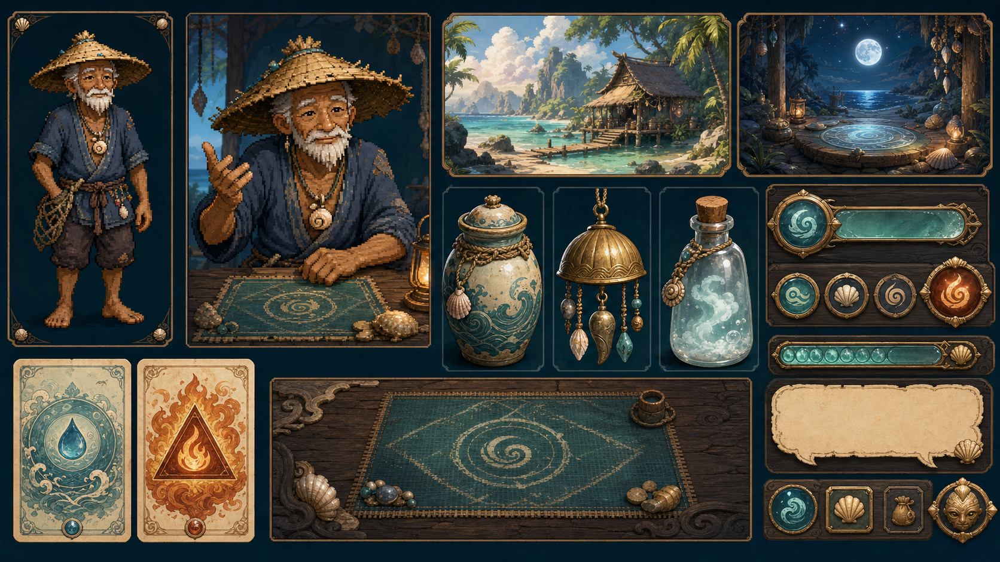

# 《万物之岛》美术风格语言与资产规范 v0.1

> 文档状态：首轮美术决策基线  
> 适用范围：人物、动物、地图、建筑、造物、材料、命运牌、界面、特效与动画  
> 关联文档：`01_万物合成系统设计_v0.1.md`、`02_命运牌会系统设计_v0.1.md`、`07_地图与移动系统设计_v0.1.md`、`10_原型试玩反馈与全面细化计划_v0.1.md`  
> 决策原则：先统一语言，再生产素材；先完成一个可运行的垂直切片，再批量扩展。

本文件是 v0.1 的生产基线，不是情绪参考集。后续所有新素材、动画和界面必须能够用本文件中的规则验收。若开发中需要改变像素规格、主色、构图、角色比例或媒介分工，应先更新本文件版本，再批量返工素材，不能在单个页面中自行改变风格。

当前风格总览图：[`art_direction_board_v1.png`](../main/assets/art/style_guide/art_direction_board_v1.png)



## 1. 核心方向

### 1.1 一句话定义

**温暖潮湿的热带幻想岛：像素岛民生活在柔和手绘的世界里，人们收集精细绘制的奇物，并通过海玻璃、深色木材、旧纸与贝壳金构成的场景化界面与世界互动。**

### 1.2 核心关键词

- 温暖、潮湿、有海风；
- 日常生活感与轻微神秘感并存；
- 手工制作留下的细小不完美；
- 清楚、克制、容易辨认；
- 像素人物有明确轮廓与真实逐帧动作；
- 合成造物有值得停下来观看和收藏的精细插图；
- 财富不是冷冰冰的数字，而是金贝、器物、席位、建筑与岛上生活的可见变化。

### 1.3 情绪比例

| 情绪 | 建议占比 | 表现方式 |
|---|---:|---|
| 温暖生活 | 45% | 暖沙、木材、布棚、饭食、灯光、人物小动作 |
| 海岛清新 | 30% | 青绿海水、湿润空气、开阔天空、海风与植被摆动 |
| 神秘奇想 | 20% | 万象塔、造化盆、水火命牌、夜间微光与符号 |
| 紧张风险 | 5% | 牌局、竞速和重大得失时短暂提高对比，不覆盖日常基调 |

### 1.4 禁用方向

- 禁止把人物做成半写实、摄影感或高精度 AI 肖像，再用缩放、上下浮动冒充动画。
- 禁止直接套用现代后台、金融软件或网页仪表盘式 UI。
- 禁止玻璃拟态大面积覆盖、纯霓虹赛博、金属科幻、维多利亚蒸汽朋克和中世纪欧洲酒馆套皮。
- 禁止地图、人物、物品分别使用互不关联的光向、色温和透视。
- 禁止用大量花纹、噪点和高对比细节填满背景，导致角色和交互点难以识别。
- 禁止使用标准扑克牌花色、筹码、赌桌绿毡等现实扑克视觉符号。
- 禁止使用 Emoji、系统图标或风格不统一的网络图标充当正式图标。
- 禁止把“更精美”理解为更写实、更锐利、更拥挤。
- 禁止在未经确认的情况下让生成工具直接批量制作整套角色动画。

## 2. 媒介层级与一致性

本项目采用有规则的混合媒介，而不是要求所有内容都变成同一种画法。不同媒介负责不同信息层级，但共享同一色板、光线、形状语言和世界气质。

| 对象 | 主要媒介 | 视觉职责 | 一致性要求 |
|---|---|---|---|
| 玩家、NPC、动物、赛兽 | 真正逐帧像素画 | 动作、个性、即时反馈 | 清楚轮廓、有限角色色板、整数缩放、统一像素密度 |
| 地图、自然环境、建筑 | 低频柔和手绘 | 地点气氛、路径、地标 | 降低细碎纹理，给像素人物留出清晰活动空间 |
| 材料、合成造物、收藏品 | 精细手绘单物件插图 | 发现、收藏、价值感 | 统一视角、光向、底台、留白与稀有度表现 |
| 水火命牌 | 手绘版画与符号设计 | 规则识别、占卜感 | 水火依靠形状和名称区分，不能只依靠颜色 |
| UI 面板和控件 | 场景化 9-slice 与 Theme | 信息组织、交互 | 海玻璃、旧纸、深木、贝壳金；克制纹理，不遮文字 |
| 特效 | 像素粒子与柔光分层 | 强调动作和结果 | 靠近角色的特效保持像素边缘，环境光晕可以柔化 |
| 字体 | 高可读中文字体 | 阅读与数值判断 | 不强制像素字体；正文可读性优先 |

一致性不等于相同分辨率。像素人物与手绘背景并存时，必须做到：人物轮廓对比最高、背景纹理频率更低、光源方向一致、接触阴影一致，角色脚底不能像贴纸一样漂在场景上。

## 3. 基础色板

以下颜色为建议母色。允许为日夜、天气和材质做明度变化，但同一功能不得在不同界面任意换色。

| 名称 | HEX | 语义用途 |
|---|---|---|
| 深海墨 | `#102D32` | 主界面深色底、夜间最暗处、正文深色字 |
| 潮湾青 | `#1E5452` | 牌桌、二级面板、海玻璃主体 |
| 海玻璃 | `#4C8D88` | 可交互边框、普通选中、浅层装饰 |
| 浪沫白 | `#D8ECE7` | 深底正文、清爽高光、海浪 |
| 旧纸白 | `#F4E9D0` | 卡面、说明页、浅色面板 |
| 暖沙 | `#F3DDA8` | 日间地面、提示底色、温暖留白 |
| 贝壳金 | `#E6B84E` | 重要按钮、发现、胜利、稀有边框 |
| 旧木褐 | `#6E4933` | 木框、桌沿、建筑梁柱 |
| 珊瑚橙 | `#D96645` | 火类、警示、行动强调 |
| 火光橙 | `#E96A38` | 火焰高光、短时高风险反馈 |
| 水光青 | `#3B9DB7` | 水类、冷色反馈、信息提示 |
| 叶影绿 | `#4E7A4C` | 植被暗部、成功与恢复 |
| 夜潮靛 | `#22324D` | 夜空、远景、神秘背景 |
| 失利红 | `#C65B5B` | 净亏损、不可逆失败；只做小面积强调 |
| 禁用灰 | `#738789` | 不可操作、次要说明；不可用于正文主信息 |

### 3.1 颜色使用规则

- 主界面同时出现的强调色不超过三种。
- 贝壳金用于“值得注意”，不能把所有边框和标题都涂成金色。
- 金贝数值默认使用浪沫白；获得时短暂使用贝壳金，损失时短暂使用失利红。
- 水类采用“水光青＋圆形/涟漪符号”，火类采用“珊瑚橙＋三角/焰尖符号”，保证色觉异常玩家仍能区分。
- 旧纸白上的正文使用深海墨；深海墨和潮湾青上的正文使用浪沫白。
- 正文、按钮文字与背景应达到清楚可读的对比，禁止用贝壳金小字直接压在暖沙或旧纸白上。

## 4. 尺寸、比例与像素网格

### 4.1 屏幕基线

- 设计参考分辨率：`1280×720`。
- 最低支持分辨率：`1280×720`，核心玩法在此尺寸下不能依赖滚动才能看全。
- 必测分辨率：`1280×720`、`1600×900`、`1920×1080`。
- 安全边距：四边至少 16 px；关键按钮与数值距离窗口边缘至少 24 px。
- 基础间距采用 4 px 网格，常用间距为 8、12、16、24、32 px。

### 4.2 世界人物规格

| 项目 | 规格 |
|---|---|
| 单帧画布 | `48×64 px` |
| 建议显示倍率 | `2×`，即屏幕中约 `96×128 px` |
| 方向 | 下、左、右、上四方向 |
| 脚底基准点 | `(24, 58)`，所有帧保持不变 |
| 头顶安全区 | 至少 3 px，不允许发饰被切断 |
| 左右边距 | 动作最宽帧仍保留至少 2 px |
| 角色高度 | 普通成人约 52—56 px；儿童、老人、壮硕角色通过轮廓区分，不任意改变脚底线 |

世界角色不做统一“大头娃娃”模板。头身建议在 `1:3—1:4` 之间，优先保证发型、帽子、衣摆和手持物的轮廓可辨。

### 4.3 牌桌人物规格

| 项目 | 规格 |
|---|---|
| 单帧画布 | `96×96 px` |
| 显示倍率 | `1×` 或 `2×`，同一页面内不得混用非整数倍率 |
| 构图 | 坐姿或半身三分之四视角，朝向桌心 |
| 基准点 | 座椅/桌沿接触点固定，不随表情和呼吸漂移 |
| 表情区域 | 眼、眉、嘴必须至少形成 3 种可读状态 |
| 手部区域 | 静观、跟契、加契、退契应有不同手部或身体动作 |

牌桌像素角色是独立于世界行走图的演出资源，不能把世界小人机械放大，也不能继续使用静态写实肖像。

### 4.4 动物与赛兽

- 小动物单帧采用 `32×32 px` 或 `48×48 px`，同种动物固定一种规格。
- 赛兽根据体型使用 `64×48 px` 或 `80×64 px`，保持足够的奔跑姿态差异。
- 所有脚步动画共用固定地面线；尾巴、耳朵和布饰可以越过身体框，但不能越过单帧画布。

## 5. 逐帧动画规范

静态图平移、缩放、旋转、呼吸浮动不算人物动画。人物动作必须由经过设计的不同姿态帧组成。Tween 只负责卡牌、金贝、提示、相机和面板等程序性演出。

### 5.1 世界角色基础动画

| 动画 ID | 帧数 | FPS | 循环 | 关键要求 |
|---|---:|---:|---:|---|
| `idle_<dir>` | 4 | 5 | 是 | 身体重心稳定，只做轻微呼吸、眨眼或衣摆变化 |
| `walk_<dir>` | 6 | 10 | 是 | 左右脚节奏明确，头顶起伏不超过 1 px |
| `talk_<dir>` | 4 | 8 | 是 | 嘴部、手势或肩部至少有一处真实变化 |
| `interact_<dir>` | 6 | 10 | 否 | 第 4 帧为接触/使用视觉节点 |
| `pickup_<dir>` | 6 | 10 | 否 | 下蹲、触碰、起身完整，不瞬移物品 |
| `happy_<dir>` | 8 | 12 | 否 | 用于发现、委托完成与较大盈利 |
| `sad_<dir>` | 6 | 8 | 否 | 用于失败或较大亏损，不夸张羞辱角色 |

玩家专项动作根据玩法追加：`fish_cast`、`fish_wait`、`fish_reel`、`synthesize_place`、`synthesize_reveal`。专项动作仍遵守同一脚底基准点。

### 5.2 牌桌角色基础动画

| 动画 ID | 帧数 | FPS | 循环 | 关键要求 |
|---|---:|---:|---:|---|
| `table_idle` | 4 | 4 | 是 | 保持安静，不做整张立绘缩放 |
| `table_think` | 6 | 6 | 是 | 视线、手指、姿态表现思考；不能只加问号 |
| `table_check` | 5 | 10 | 否 | 明确表现静观/暂不追加投入 |
| `table_call` | 6 | 10 | 否 | 手部推动金贝或做出跟契动作 |
| `table_raise` | 8 | 12 | 否 | 动作幅度高于跟契，并给出确认停顿 |
| `table_fold` | 6 | 10 | 否 | 收拢或推开命牌，姿态退出牌局 |
| `table_all_in` | 8 | 12 | 否 | 是高风险动作，不与普通加契共用动画 |
| `table_talk` | 4 | 8 | 是 | 与对白气泡同步，允许角色专属手势 |
| `table_win` | 10 | 12 | 否 | 胜利反应后回到待机，不持续抖动 |
| `table_lose` | 8 | 8 | 否 | 明确失落但保持人物尊严与性格差异 |

### 5.3 播放与事件约定

- 逐帧人物使用 `AnimatedSprite2D` 和共享 `SpriteFrames` 资源。
- `AnimationPlayer` 只负责人物动画之外的同步内容，例如音效、牌面翻转、金贝移动、气泡出现和局部特效。
- 同一个 Sprite 属性只能有一个动画控制者，禁止 `AnimatedSprite2D`、Tween 和 `AnimationPlayer` 同时修改帧、位置或缩放。
- 循环动画监听 `animation_looped`，非循环动画监听 `animation_finished`。
- 需要逐帧音效或粒子时使用 `frame_changed`，事件名称统一为：`footstep`、`blink`、`hand_contact`、`card_release`、`shell_release`、`vfx_emit`、`voice_bark`。
- 核心规则不得依赖动画帧才能结算。逻辑先生成确定结果，表现层根据事件排队播放；动画结束只负责解除表现锁或进入下一段演出。
- 普通交互动作总时长建议为 `0.35—0.8 秒`；重大胜负和首次发现可延长至 `1.2—2.5 秒`，并允许玩家加速或跳过重复演出。

## 6. 人物与动物设计

### 6.1 角色识别顺序

角色在没有文字和颜色时，也应按以下顺序被识别：

1. 外轮廓：身高、体态、帽子、发型、背包或手持物；
2. 主色块：每人 1 个主识别色和 1 个辅助色；
3. 动作习惯：迟缓、利落、谨慎、夸张、沉稳；
4. 面部表情：只做强化，不承担全部识别任务。

### 6.2 像素绘制规则

- 单个角色常用颜色控制在 12—20 色，角色专属色从全局母色偏移而来。
- 轮廓不使用纯黑，暗部优先使用深海墨、夜潮靛或带色暗部。
- 高光面积小于主体面积的 15%，不使用细密渐变和半透明毛边。
- 同一条轮廓不能混用 1 px、2 px 和模糊抗锯齿边缘。
- 头发、衣摆、饰物的次级运动必须滞后主体 1—2 帧，不能每帧随机变化。
- 不对像素角色使用双线性过滤、AI 插帧或自动平滑。

## 7. 环境、地图与建筑

### 7.1 绘制方向

环境采用柔和手绘，而不是照片写实或高密度概念图。远景轮廓最大、细节最少；中景负责建筑与道路；近景只在边缘放置少量遮挡和气氛物件。

建议按以下层级交付：

```text
far_sky / far_sea
mid_landscape
buildings
walkable_ground
foreground_occluders
weather_and_light_overlay
interaction_markers（程序层，不画死在背景中）
```

### 7.2 可玩性规则

- 玩家可走区域与不可走区域必须通过地面形状、边缘、台阶、植被或栏杆自然区分。
- 主路径的明度或色相与周围地面至少有一项明显差异。
- NPC 站位后仍须保持清晰轮廓；人物背后避免与人物同明度、同颜色的高频纹理。
- 地图上的文字、按钮、交互圈和任务标志不得画入背景。
- 背景画面约 70% 为低对比区域，地标和交互点使用剩余的高对比预算。
- 场景可以有风、浪、叶片和灯火动画，但每屏同时高频运动的区域不超过三处。

### 7.3 万象塔规范

万象塔是全岛长期目标的主地标，轮廓应在缩小到 10% 时仍能辨认。塔分四个可见层级，对应图鉴与献塔进度；基础轮廓固定，进度通过窗光、悬挂物、风饰、平台活动和局部修缮逐层改变。禁止只把普通高楼放大，或用纯数值进度条替代塔的可见变化。

### 7.4 光照

- 默认日间主光从画面左上方照入，色温偏暖；海面与阴影提供偏青反光。
- 室内与夜间仍遵守可解释光源：灯笼、月光、炉火或万象塔微光。
- 人物、造物和建筑的主高光方向必须一致。
- 天气通过整体色调、云影、地面湿润度与粒子改变，不用高不透明度纯色蒙版覆盖所有内容。

## 8. 合成物品、材料与收藏品

合成物品保留当前精细手绘插图方向，不改成像素图。目标是让第一次合成像获得一件真正值得收藏的奇物，而不是获得一个通用小图标。

### 8.1 单物件插图规格

- 源文件：`512×512 px`，透明背景或独立可控底层。
- 运行时常用尺寸：`128×128 px` 或 `256×256 px`，按页面使用同一档位。
- 主体占画布面积约 68%—80%，四周保留呼吸空间。
- 默认三分之四视角，主光来自左上，右下有短而柔和的接触阴影。
- 材料强调质地；造物强调结构、用途和一点超现实关系。
- 单件图不包含文字、价格、稀有度框、按钮或场景背景。
- 稀有度通过边框、底台、发现演出和局部微光表达，不直接把物件整体染色。

### 8.2 合成结果的构图要求

- 新造物必须能从图中看出至少两个投入材料之间的联系。
- 图像中心不等于机械居中：重心要稳定，工具把手、风帆等长形物允许偏移。
- 同一类别保持相近镜头距离，不能一个是远景小物件、一个是贴脸特写。
- 图鉴列表使用裁切后的统一缩略图；发现页使用完整原图，不用同一张低分辨率缩略图放大。

### 8.3 现有素材处理

| 文件 | v0.1 定位 |
|---|---|
| `synthesis_collection_atlas_v1.png` | 保留为造物插图方向参考，拆分前需检查比例、光向与九格一致性 |
| `shop_material_atlas_v1.png` | 保留为材料方向参考；正式生产改为单物件导出后再打包图集 |
| `island_panorama_v1.png` | 仅作地点与色彩概念参考，不能直接定义最终地图视角与可走区域 |
| `oracle_table_backdrop_v1.png` | 仅作气氛参考，牌桌必须按固定舞台布局重新设计 |
| `poker_npc_portraits_v1.png` | 不作为正式人物素材；由逐帧像素角色替换 |
| `race_banner_v1.png` | 仅作竞速氛围参考；赛兽与赛程需要可拆分、可动画资产 |

## 9. 水火命牌

### 9.1 卡面规格

- 设计比例：`2:3`。
- 源文件：`320×480 px`；常用运行时显示为 `80×120 px`、`96×144 px` 或整数倍。
- 安全区：四周至少 20 px，名称和势阶不能贴边。
- 卡背与卡面使用同一圆角和边框厚度，翻牌时不发生尺寸跳变。

### 9.2 视觉结构

```text
顶部：水之兆 / 火之兆类别名
中央：独立征兆图形与物象（水滴、雨幕、溪流……）
下部：具体牌名
底部：1—6 个势阶刻度
边缘：类别纹样，水为圆弧涟漪，火为尖角焰纹
```

- 水牌以圆形、下坠、流线为主；火牌以三角、上升、放射为主。
- 卡面为手绘版画感，不使用标准扑克的角标、花色和对称人头牌结构。
- 牌背不能透露水火类别与势阶。
- 命象高亮使用描边、连接线和短动画说明构成关系，不只给出一个名称。

## 10. UI 视觉语言

### 10.1 材质分工

| 材质 | 用途 | 使用限制 |
|---|---|---|
| 海玻璃 | 次级面板、信息层、悬浮提示 | 透明度要保证文字可读，不做大面积高光反射 |
| 深色木材 | 外框、牌桌边缘、商店与建筑式窗口 | 纹理对比低于文字，不铺满所有内容区 |
| 旧纸 | 规则、图鉴、信件、卡面 | 不用于快速变化的大量数字面板 |
| 贝壳金 | 选中、稀有、胜利、关键分隔 | 只做小面积重点，不作为普通面板底色 |
| 布与编织物 | 商店货架、赛事、生活类标签 | 保持简化，不模拟真实照片纹理 |

### 10.2 控件层级

- 所有控件由一个共享 Godot `Theme` 管理，通过 `theme_type_variation` 表达主按钮、次按钮、危险按钮、卡牌按钮和标签。
- 常规面板圆角建议 6—10 px，边框 2 px；不使用当前网页式大圆角胶囊作为所有控件的默认形状。
- 主按钮至少 `112×44 px`；图标按钮至少 `44×44 px`；相邻按钮间距至少 8 px。
- Hover 通过明度、边框和 1—2 px 位移反馈；按下状态通过内陷和短音效反馈，不使用大幅缩放。
- 禁用状态必须同时降低对比并给出原因提示，不能只变灰。

### 10.3 牌桌界面空间规则

- 中央牌桌是固定舞台，永远不放入 `ScrollContainer`。
- 六个席位锚定在牌桌周围；人物、钱包、当前投入和本次动作属于席位组件，不通过左侧日志代替。
- 公共天象固定在桌心，玩家命牌和操作栏固定在底部。
- 对白气泡位于覆盖层，不参与容器排版，不得把人物或公共牌向下挤。
- 只有牌局记录和完整规则可以滚动。
- `1600 px` 及以上可同时显示左右工具栏；`1280—1599 px` 将低优先级工具栏收为抽屉或标签页，牌桌本体不能缩成折叠列表。

### 10.4 排版密度

- 单个区域只保留一个主标题；相同结果不在中间、右侧和底部重复三次。
- 高频变化信息采用“钱包 / 本手投入 / 当前动作”三项固定顺序。
- 每个数字必须带真实语义单位，例如“持有 120 金贝”，不使用无法解释的替代筹码或桌上钱包。
- 日志负责复盘，席位动作负责即时反馈，结算条负责最终结果，三者不得互相复制全文。

## 11. 字体与图标

### 11.1 字体

- 正文优先使用思源黑体或 Noto Sans CJK SC 一类高可读开源中文字体。
- 标题可使用霞鹜文楷一类带手写温度的字体，但必须确认授权并在小字号下保持清楚。
- 中文 UI 不强制使用像素字体；像素人物和像素特效已经承担像素风识别，正文可读性优先。
- `1280×720` 基线字号：大标题 28—32 px，区域标题 22—24 px，正文 17—18 px，次要说明 14—15 px。
- 金贝、赔率、投入等数字使用等宽数字特性；同一列数值变化时不能左右跳动。
- 正文行高为字号的 1.35—1.5 倍，禁止过密堆叠。

### 11.2 图标

- 常用尺寸为 24、32、48 px；同一组使用相同画布和视觉重量。
- 图标采用实心剪影加一层内部切口，或 2 px 手绘描边；不能在一组里混用线性、写实和 Emoji。
- 所有状态图标必须同时有文字或可读提示，首次出现不能只靠图形猜测。
- 水、火、金贝、时间、背包、地图、图鉴形成第一批全局图标，并建立统一源文件。

## 12. 构图与信息优先级

### 12.1 场景构图

- 每屏只设一个第一视觉焦点，最多两个第二焦点。
- 角色活动区避免强烈透视线切过头部和身体。
- 交互地点应先通过建筑轮廓、灯光、招牌形状被看见，再由程序标记确认。
- 背景装饰不能挡住玩家、NPC、门口、路径和交互标记。

### 12.2 界面构图

信息优先级从高到低为：

1. 当前需要做的选择；
2. 选择会改变的金贝、物品或状态；
3. 对手、世界或系统刚刚发生的动作；
4. 规则解释与历史记录；
5. 装饰与气氛。

若空间不足，应先折叠第 4、5 级，不能裁切第 1—3 级。

## 13. Godot 导入与显示规则

本项目同时存在像素素材和手绘素材，不能把全局纹理过滤简单设成同一种模式。

### 13.1 像素素材

- 导入压缩使用无损模式。
- `Filter` 关闭或在所属 `CanvasItem` 上使用 `Nearest`。
- `Mipmaps` 关闭。
- 显示倍率只允许 1×、2×、3×等整数。
- Sprite 位置最终落在整数像素；脚底基准点不使用小数。
- SpriteSheet 每格尺寸必须完全一致，周围无抗锯齿半透明毛边。

### 13.2 手绘素材

- 使用线性过滤，缩小时可按场景需要启用 mipmap。
- 有透明边缘的物件优先使用 PNG 或无损 WebP；大型不透明背景可使用高质量有损格式。
- 不把 512 px 图鉴原图直接加载到所有 32 px 小图标位置，应生成运行时缩略图或图集。
- 透明边缘保留 2—4 px 安全扩边，避免打包图集后出现漏色。

### 13.3 混合场景

- 像素人物放在独立节点层，继承 `Nearest`；手绘背景与 UI 插图保持 `Linear`。
- 相机移动需要像素对齐时，人物层进行像素吸附，背景可以平滑移动；禁止用模糊人物换取相机平滑。
- UI 缩放不得把 1 px 像素边缘变为非整数宽度；需要伸缩的框体使用 9-slice，不拉伸角部。

## 14. 文件命名与目录

### 14.1 资源分区

源文件与运行时文件分开保存，避免 Godot 导入大型分层稿和无用过程图。

```text
TreasureLand/
├─ art_source/                         # 分层源稿、提示词、色板、参考和修改记录
│  ├─ style_guide/
│  ├─ characters/
│  ├─ environments/
│  ├─ items/
│  ├─ cards/
│  └─ ui/
└─ main/assets/art/                    # 仅放 Godot 实际使用的导出文件
   ├─ style_guide/
   ├─ characters/<character_id>/
   │  ├─ world/
   │  └─ oracle_table/
   ├─ creatures/<creature_id>/
   ├─ environments/<area_id>/
   ├─ buildings/<building_id>/
   ├─ items/materials/
   ├─ items/creations/
   ├─ cards/oracle/
   ├─ ui/frames/
   ├─ ui/icons/
   ├─ ui/cursors/
   ├─ vfx/
   └─ fonts/
```

### 14.2 命名格式

文件名统一使用小写英文 `snake_case`，显示名称保存在数据资源中，不使用中文文件名和空格。

```text
<domain>_<subject>_<state>_<direction>_<variant>_v###.<ext>
```

示例：

```text
chr_laoqiao_walk_down_base_v001.png
chr_laoqiao_table_think_base_v001.png
itm_salted_fish_collection_v001.png
env_coconut_street_day_clear_v001.webp
bld_all_things_tower_stage_01_v001.png
card_water_ocean_face_v001.png
ui_panel_seaglass_primary_v001.png
ico_currency_shell_24_v001.png
```

- `v001` 表示文件修订，不等于设计文档版本。
- 同一资源的尺寸变体追加 `_128`、`_256`，不能覆盖原图后靠文件时间判断。
- 图集同时提供同名 `.tres` 或清单文件，明确格数、帧名、FPS、基准点和事件帧。
- 废弃文件移入源文件归档区，不在运行时目录中保留 `_old`、`_new`、`_final2`。

## 15. 生成式素材生产模板

生成工具只负责提供可控的生产起点。角色设定、像素清理、帧格对齐、动作连贯性和最终验收仍需人工或程序检查。一次生成整套 SpriteSheet 不可直接进入项目。

### 15.1 像素角色设定稿模板

```text
《万物之岛》角色设定，[角色名与身份]。
温暖潮湿热带幻想，清楚的像素画轮廓，48×64世界角色比例，头身约1:3.5，
使用全局色板中的[主色]与[辅助色]，深海墨带色轮廓，左上暖光与海面青色反光。
展示正面、背面、左侧、右侧和三个表情，发型、衣摆、手持物轮廓稳定，透明背景。
不包含文字、UI、环境、写实皮肤、照片感、平滑抗锯齿、3D渲染、标准动漫厚涂。
```

设定稿通过后，再按单个动作制作帧组：

```text
沿用已确认的[角色名]像素设定，制作[动画ID]动作参考。
严格[帧数]帧，每帧[宽]×[高]像素，同一脚底基准点，同一角色比例、服装、颜色和光向。
动作描述：[起势—关键动作—缓冲—回位]。
透明背景，无文字、无格线、无额外物件、无插帧模糊、无帧间服装变化。
```

### 15.2 合成造物模板

```text
《万物之岛》图鉴造物插图：[造物名]，由[材料A]与[材料B]的关系形成。
温暖热带幻想手绘，单个物件，三分之四视角，左上暖光、右下柔和接触阴影，
清楚表现[材质]、[用途]与[奇想关系]，精细但不过度写实，主体占画面约75%，
512×512，透明背景，不含人物、文字、价格、边框、按钮、场景、水印或多余道具。
```

### 15.3 环境与建筑模板

```text
《万物之岛》可玩场景：[地点名]，[时间与天气]。
柔和低频手绘热带幻想，左上暖光、海面青色反光，深海青、暖沙、旧木和叶影绿母色，
明确的可走路径、入口与[核心地标]，远中近景分层，人物活动区低对比且无高频纹理，
预留NPC站位和交互标记空间；无人物、文字、UI、按钮、水印、摄影写实或不可解释的强透视。
分层交付：远景、地形、建筑、前景遮挡、天气光效。
```

### 15.4 命牌与 UI 模板

```text
《万物之岛》[水/火]之兆卡面或场景化UI部件。
海玻璃、深色木材、旧纸和贝壳金的热带手工艺语言；[圆弧涟漪/尖角焰纹]形状体系，
清楚的二维正视构图，低对比材质纹理，边缘适合9-slice或卡牌裁切，
不含标准扑克牌花色、筹码、赌场符号、现代网页组件、霓虹科技感、照片纹理、文字和水印。
```

## 16. 验收门槛

任何素材进入 `main/assets/art/` 前，至少通过以下检查。

### 16.1 风格验收

- [ ] 不看文件名也能判断它属于温暖潮湿的热带幻想岛。
- [ ] 与同类素材共享色板、光向、视角和细节密度。
- [ ] 像素人物、手绘物件和背景同时出现时没有贴纸感。
- [ ] 没有落入禁用方向，也没有残留生成水印、乱码或无意义纹样。

### 16.2 技术验收

- [ ] 文件尺寸、命名、透明边缘、轴心和帧格符合本规范。
- [ ] 像素素材以 1×、2×、3×显示时轮廓清楚，无过滤模糊和非整数抖动。
- [ ] 循环动画首尾自然，脚底线不漂移，服装与道具不变形。
- [ ] 非循环动画能正确发出结束信号；事件帧与音效、牌或金贝释放点一致。
- [ ] 大型插图有运行时缩略版本，不因单页大量加载造成明显卡顿。

### 16.3 玩法与 UI 验收

- [ ] `1280×720` 下核心玩法完整可见，玩家不需要滚动牌桌或合成主操作区。
- [ ] `1600×900` 与 `1920×1080` 下不出现拉伸、巨大空洞和非整数像素人物。
- [ ] 文本、按钮、数值不被角色、宠物、特效和装饰遮挡。
- [ ] 当前行动者、行动内容、金贝变化和最终结果各有唯一清楚位置。
- [ ] 水火、稀有度、成功失败均不只依赖颜色表达。
- [ ] 每个拆分出的 UI 场景能够独立运行并完成截图检查。

### 16.4 动画验收

- [ ] 人物动作由真实不同姿态帧构成，不是静态图缩放、旋转或上下浮动。
- [ ] NPC 的思考停顿来自回合表现队列，不是随机卡死；重复牌局允许加速。
- [ ] 对白、表情、手势和行动语义一致。
- [ ] 同一时刻只突出一个主要行动者，其他角色保持低频待机。
- [ ] 逻辑结算与表现播放分离；跳过动画不会改变牌局结果。

## 17. Do / Don't

| Do | Don't |
|---|---|
| 先做一名角色完整样片，再扩展全员 | 一次生成五名NPC和几十个动作后统一返工 |
| 让人物靠轮廓、色块和动作被识别 | 只靠头像旁的名字识别人物 |
| 用逐帧姿态表现思考、下注和退契 | 对静态肖像做呼吸缩放 |
| 手绘物品保留材质与发现奖励感 | 把所有物品压成低信息量像素小图标 |
| 背景主动降低活动区细节 | 用复杂背景证明“素材很精美” |
| 牌桌保持固定舞台，侧栏按宽度收纳 | 把核心牌桌放进滚动容器纵向堆叠 |
| 用共享 Theme 和语义变体统一控件 | 每个脚本单独创建颜色和 StyleBox |
| 用文字、形状和颜色共同表达状态 | 只用蓝色/橙色区分水火 |
| 为同一动作设置统一帧格和轴心 | 依靠运行时偏移修补每帧跳动 |
| 把生成结果当待验收源稿 | 把第一次生成的图集直接当正式素材 |

## 18. 首个垂直切片

首轮只验证一套能够长期复制的完整生产链，不追求一次替换全部旧素材。

### 18.1 范围

1. **风格总览图**：同页展示像素人物、手绘场景、合成造物、水火命牌、主按钮、信息面板、金贝与时间图标，并标注母色和禁用示例。
2. **老乔双场景角色样片**：首名验证角色确定为老乔。世界样片完成四方向 `idle`、`walk`，以及朝下的 `talk`、`interact`；牌桌坐姿样片完成 `table_idle`、`table_think`、`table_call`、`table_fold`、`table_talk`、`table_win` 六组逐帧动画。老乔只用于验证像素密度、基准点、动作接口和生产流程，不是全体角色共用的身体模板；其余人物必须重新设计自己的身高、体态、轮廓和动作习惯。
3. **命运牌会固定舞台**：重做中央牌桌、六个固定席位、公共天象区、玩家命牌区、底部操作栏和可收起的规则/记录抽屉。
4. **一段完整行动演出**：NPC开始思考 → 对白 → 跟契并推动金贝 → 钱包与底池更新 → 下一位获得焦点。
5. **三档截图与运行验收**：`1280×720`、`1600×900`、`1920×1080` 均无遮挡、无折叠、无核心区域滚动。

### 18.2 通过条件

- 玩家第一眼看见的是完整牌桌与正在行动的人，而不是日志、规则或重复结果。
- 老乔在世界中的待机、行走、说话、交互，以及牌桌上的六种状态，都可以只看动作辨认，不依赖状态文字。
- 像素人物与手绘桌面、命牌、UI 共存时像同一个世界，不像临时贴图。
- 更换NPC数据时可以复用同一个席位场景和动画接口。
- 垂直切片通过后，才能依次生产其余四名NPC各自不同轮廓的世界与牌桌动画、更多场景与竞速动画。

## 19. v0.1 决策摘要

本版本锁定以下决策：

1. 人物、动物和赛兽使用真正逐帧像素动画；静态肖像 Tween 不再作为人物动画方案。
2. 合成造物与收藏品保留精细手绘插图方向，不强制像素化。
3. 地图和建筑使用低频柔和手绘，主动服务路径、角色和交互可读性。
4. UI 使用海玻璃、深木、旧纸与贝壳金的场景化语言，并由共享 Theme 管理。
5. 牌桌采用固定舞台，不允许核心桌面滚动、折叠或被侧栏挤压。
6. 新美术先通过单角色、单场景垂直切片，再进入批量生产。

上述六项在 v0.2 评审前视为默认规则。任何例外都必须说明它改善了什么体验、影响了哪些已有资产，并通过同样的分辨率与运行验收。
